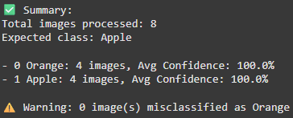

# 🍎 Fruit Classifier using Teachable Machine & Keras  
This project is a simple image classification tool that detects types of fruits (e.g., Apple, Orange) using a model trained with Google’s Teachable Machine and deployed via a Python script using Keras.

---

## 🎯 Project Goal  
Learn how to:

- Train a custom image classification model using Teachable Machine  
- Export the model in TensorFlow Keras format  
- Load and use the model in Python  
- Preprocess input images and predict their class  
- Test multiple images and view confidence scores  

---

## 📦 Tools & Technologies  
- Google Teachable Machine (Image Project)  
- TensorFlow / Keras  
- Python (PIL, NumPy)  
- Jupyter Notebook / Google Colab / VS Code  
- GitHub for version control  

---

## 🧠 Classes Used  
The model is trained to classify between at least two fruits:

- Apple  
- Orange  

---

## 🧪 How It Works  
1. Load the model and labels  
2. Preprocess the image to 224x224 and normalize  
3. Predict the class with confidence score  
4. Print the result or run on a batch of images

---

## 📸 Screenshots

---

## 👤 Author
> Designed by: [Abdulrahman Qutah]  
> Date: [2 Jul 2025]
